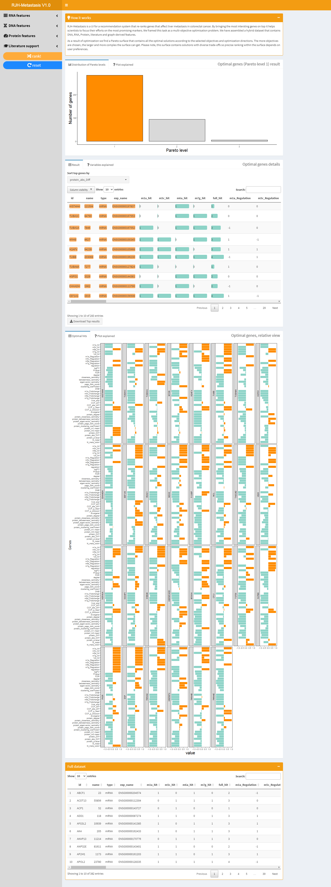
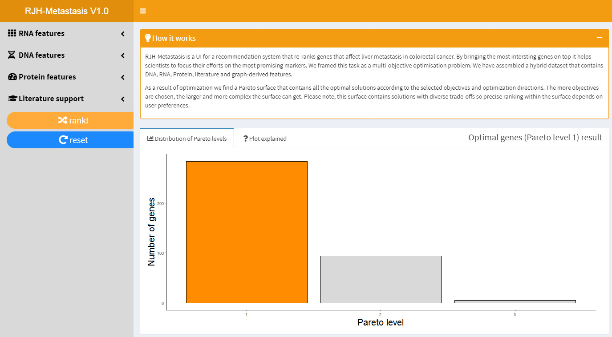
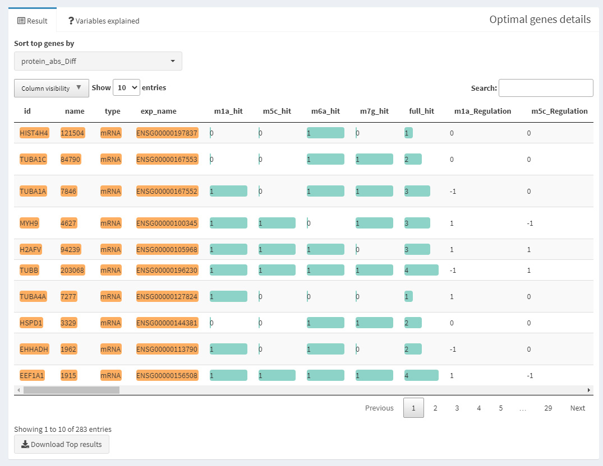
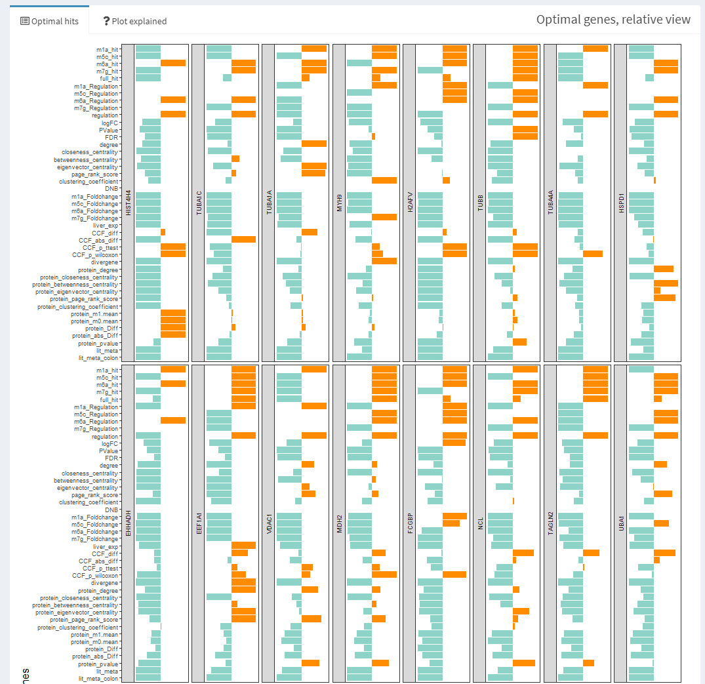

 

## RJH Metastasis

RJH-Metastasis is a UI for a recommendation system that re-ranks genes that affect liver metastasis in colorectal cancer. By bringing the most intersting genes on top it helps scientists to focus their efforts on the most promising markers. We framed this task as a multi-objective optimisation problem. 

We have assembled a hybrid dataset that contains DNA, RNA, Protein, literature and graph-derived features.

As a result of optimization we find a Pareto surface that contains all the optimal solutions according to the selected objectives and optimization directions. The more objectives are chosen, the larger and more complex the surface can get. Please note, this surface contains solutions with diverse trade-offs so precise ranking within the surface depends on user preferences.

